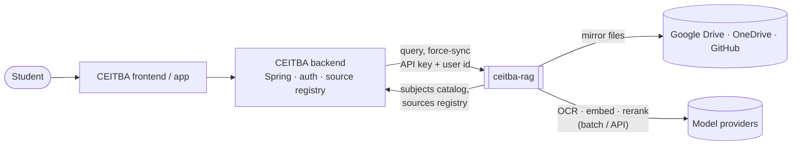
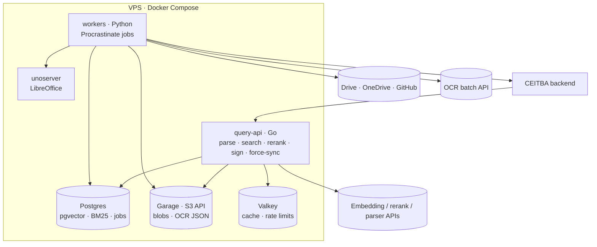
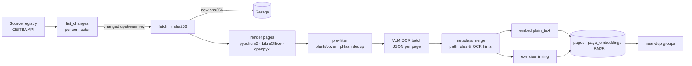
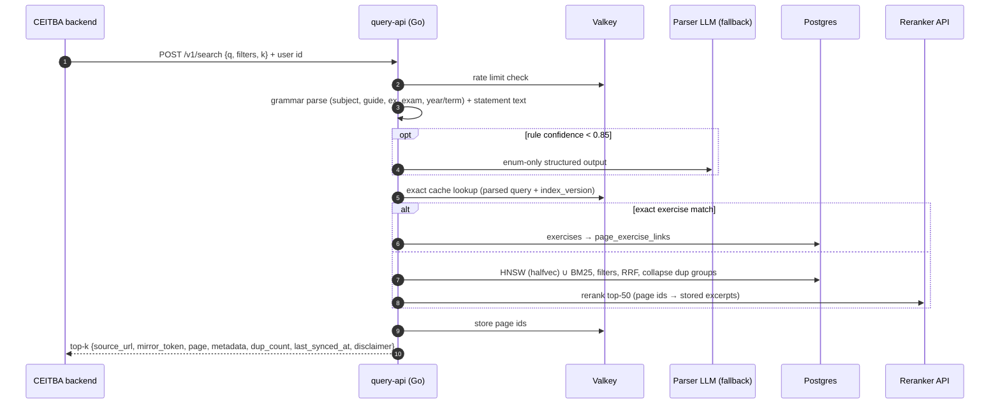
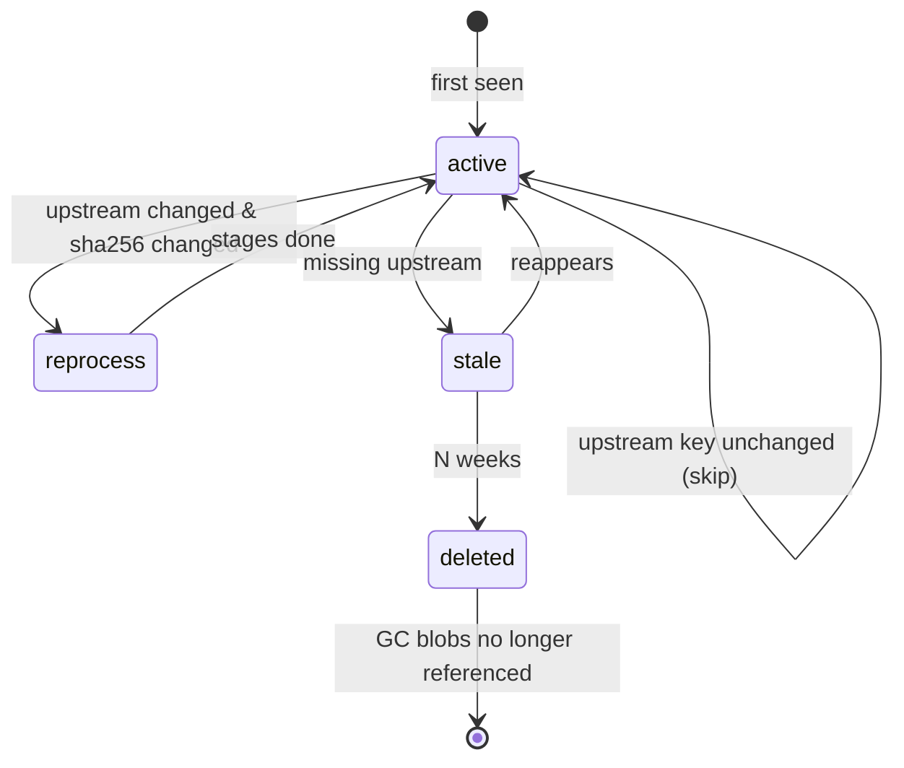
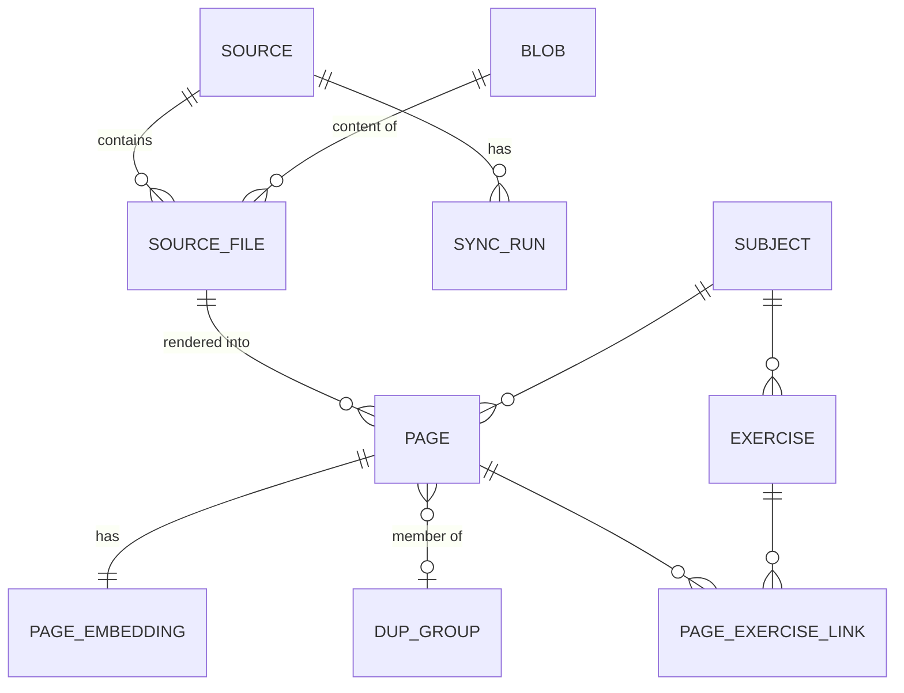

# ceitba-rag architecture

Retrieval engine that maps a Spanish natural-language query ("Ej 23 Guía 2 de Proba" or a pasted
statement) to a ranked list of existing student-note pages. It never generates answers (ADR 0001).

Mermaid blocks below are the editable source of truth (they render on GitHub). Polished versions
are produced with the `diagram-design` skill into `docs/diagrams/` (see [diagrams](#diagrams)).

## 1. System context



## 2. Containers



| Container | Language | Responsibility | ADR |
|-----------|----------|----------------|-----|
| query-api | Go | Query endpoint, result redirect/presign, force-sync requests, rate limits, cache | 0002, 0013, 0014 |
| workers | Python | Connectors, render, OCR, embed, index, dedup, exercise linking, cron | 0002, 0009, 0012 |
| Postgres | — | Metadata, transcriptions, vectors, BM25, job queue, sync state | 0005, 0009, 0011 |
| Garage | — | Content-addressed file mirror, raw OCR JSON | 0010 |
| Valkey | — | Exact result cache, embedding cache, token buckets | 0013, 0014 |

## 3. Ingestion pipeline

Each stage is an idempotent job keyed by `(sha256, stage, stage_version)`; unchanged content is
skipped at every hop (ADR 0012).



Non-PDF formats: docx/pptx → PDF via LibreOffice then the same path; xlsx/csv parsed directly;
md/tex chunked from source (no OCR); images (incl. HEIC) treated as single pages.

## 4. Query flow



The reranker receives stored transcription excerpts but returns only scores; no model output on
the query path is ever shown to the user or used as instructions.

## 5. Sync lifecycle



Triggers: weekly cron (Sun 03:00 ART); owner force-sync (own sources, cooldown default 7 days);
admin force-sync (any/all). Responses `202`, `409` (run in flight), `429` + `Retry-After`.

## 6. Data model (conceptual)



Full DDL sketches: [research 02](../research/02-retrieval-embeddings-rerank.md) (retrieval tables),
[research 04](../research/04-ingestion-sync-infra.md) (sync tables). The authoritative schema will
be `db/migrations/` (ADR 0011).

## 7. Metadata taxonomy

Values are enums in the schema; Spanish aliases live in the parser's alias table.

| Field | Values / format | Primary signal | Fallback |
|-------|-----------------|----------------|----------|
| `subject_code` | CEITBA catalog id, e.g. `93.24` | folder name ↔ catalog alias match | OCR header ("Probabilidad y Estadística 93.24") |
| `doc_type` | `guide`, `guide_solution`, `theory_summary`, `class_notes`, `midterm` (parcial), `retake` (recuperatorio), `final`, `lab`, `tp`, `other` | folder/filename rules (`Practica`, `Resumenes`, `Finales`, `1P`, `1R`, `1F`) | OCR `page_kind` + model |
| `exam_instance` | `1P`, `2P`, `1R`, `2R`, `1F`, `2F`… | filename | OCR header |
| `year`, `term` | `2024`, `1C`/`2C` | filename | OCR header |
| `guide_no` | integer | filename (`G2`, `guia2`, `Guía 2`) | OCR header |
| `exercise_labels` | `23`, `3b`, `3.b`… per page | OCR `exercise_refs` | inherited from previous page |
| `page_kind` | `statement`, `solution`, `theory`, `cover`, `blank`, `mixed` | OCR | — |
| `owner`, `source`, `source_url`, `page_no` | from connector | connector | — |
| `metadata_confidence` | 0–1 per field + `method` | — | — |

Rule: path/filename metadata beat model output; disagreements lower confidence and are
quarantined for review (ADR 0013).

## 8. Repository layout (planned)

```
api/openapi.yaml           # query-api contract
db/migrations/             # goose SQL (schema owner)
services/query-api/        # Go
workers/                   # Python (uv): connectors, pipeline, jobs
evals/                     # harness + adversarial suite (golden set stored privately)
deploy/                    # docker-compose, Garage/Valkey/Postgres config
docs/{adr,research,architecture,diagrams}/
specs/                     # Spec Kit features
```

## Diagrams

Rendered versions of sections 1–6 (self-contained HTML/SVG, `diagram-design`). To regenerate them, see
[docs/diagrams/README.md](../diagrams/README.md).

- [01 System context](../diagrams/01-system-context.html)
- [02 Containers](../diagrams/02-containers.html)
- [03 Ingestion pipeline](../diagrams/03-ingestion-pipeline.html)
- [04 Query flow](../diagrams/04-query-flow.html)
- [05 Sync lifecycle](../diagrams/05-sync-lifecycle.html)
- [06 Data model](../diagrams/06-data-model.html)
